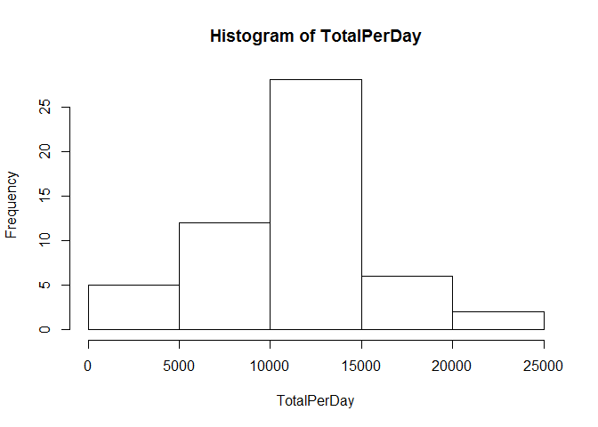
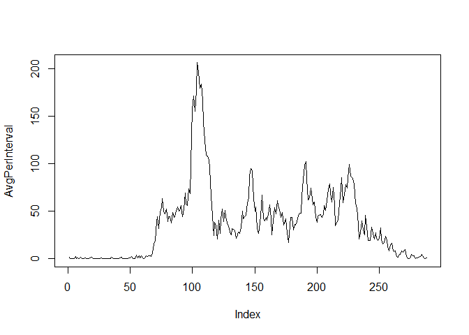
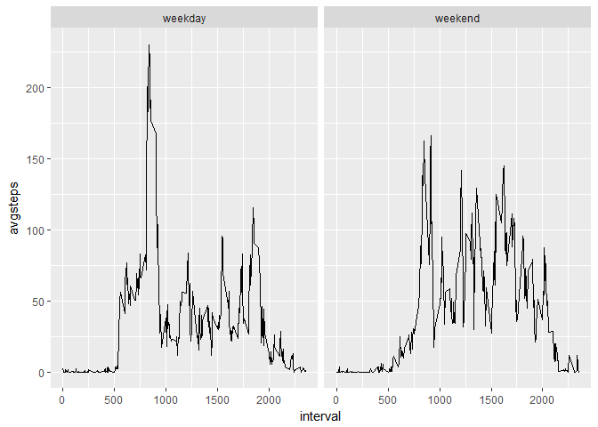

## Loading and preprocessing the data
###1. Load the data

```r
setwd("U:/General/Data_Scientist_Course/Course5_ReproducibleResearch/Project1/RepData_PeerAssessment1")
file<-"activity.zip"
unzip(file,unzip = "internal")
data<-read.csv("activity.csv")
```
###2. Process/transform the data (if necessary) into a format suitable for your analysis

```r
data$date<-as.POSIXct(data$date,"%Y-%m-%d",tz="GMT")
```

## What is mean total number of steps taken per day?
###1. Calculate the total number of steps taken per day

```r
TotalPerDay<-tapply(data$steps,data$date,sum)
```
###2. Make a histogram of the total number of steps taken each day

```r
hist(TotalPerDay)
```

<!-- -->

###3. Calculate and report the mean and median of the total number of steps taken per day

```r
#Mean Steps/Day
mean<-mean(TotalPerDay,na.rm=TRUE)
#Median Steps/Day
median<-median(TotalPerDay,na.rm=TRUE)
```
The mean number of steps taken was 1.0766189\times 10^{4}. The median number of steps taken was 10765.

## What is the average daily activity pattern?
###1. Make a time series plot (i.e. type = "l") of the 5-minute interval (x-axis) and the average number of steps taken, averaged across all days (y-axis)

```r
#Get Average Number of Steps per Interval
AvgPerInterval<-tapply(data$steps,data$interval,mean,na.rm=TRUE)
#plot them
plot(AvgPerInterval,type="l")
```

<!-- -->

###2. Which 5-minute interval, on average across all the days in the dataset, contains the maximum number of steps?

```r
#Calculate Max
max<-max(AvgPerInterval)
#Get index of interval with max
index<-match(max,AvgPerInterval)
#Pull corresponding time interval
MaxInterval<-unique(data$interval)[index]
```
The 5-minute interval with the max number of step on average was 835.

## Imputing missing values
###1. Calculate and report the total number of missing values in the dataset (i.e. the total number of rows with NAs)

```r
NumberNAs<-sum(is.na(data$steps))
```
The total number of missing values in this dataset is 2304.

###2. Devise a strategy for filling in all of the missing values in the dataset. The strategy does not need to be sophisticated. For example, you could use the mean/median for that day, or the mean for that 5-minute interval, etc.
###3. Create a new dataset that is equal to the original dataset but with the missing data filled in.

```r
#fill missing and create new
library(dplyr)
```

```
## 
## Attaching package: 'dplyr'
```

```
## The following objects are masked from 'package:stats':
## 
##     filter, lag
```

```
## The following objects are masked from 'package:base':
## 
##     intersect, setdiff, setequal, union
```

```r
newdata<-data %>% group_by(interval) %>% mutate(steps = ifelse(is.na(steps),mean(steps, na.rm=TRUE),steps))
```
## Are there differences in activity patterns between weekdays and weekends?
###1. Create a new factor variable in the dataset with two levels - "weekday" and "weekend" indicating whether a given date is a weekday or weekend day.

```r
newdata$daytype<-ifelse(weekdays(newdata$date) %in% c("Saturday","Sunday"),"weekend","weekday")
```
###2.Make a panel plot containing a time series plot (i.e. type = "l") of the 5-minute interval (x-axis) and the average number of steps taken, averaged across all weekday days or weekend days (y-axis). 

```r
#Average data by day type and interval
library(plyr)
```

```
## -------------------------------------------------------------------------
```

```
## You have loaded plyr after dplyr - this is likely to cause problems.
## If you need functions from both plyr and dplyr, please load plyr first, then dplyr:
## library(plyr); library(dplyr)
```

```
## -------------------------------------------------------------------------
```

```
## 
## Attaching package: 'plyr'
```

```
## The following objects are masked from 'package:dplyr':
## 
##     arrange, count, desc, failwith, id, mutate, rename, summarise,
##     summarize
```

```r
avgdata<-ddply(newdata, .(daytype, interval), summarize, avgsteps = mean(steps))
library(ggplot2)
ggplot(avgdata, aes(x = interval, y = avgsteps)) + geom_line() + facet_wrap(~daytype)
```

<!-- -->
